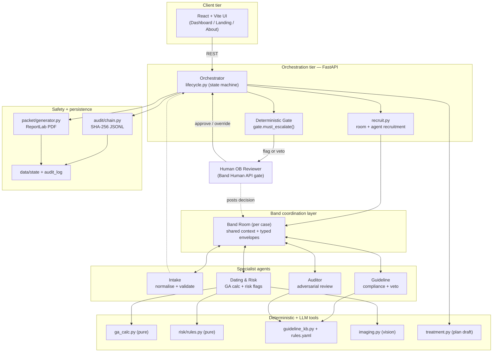
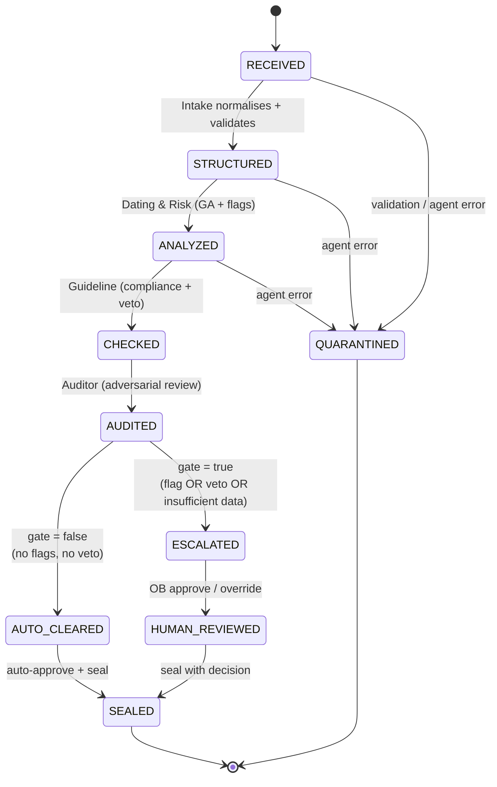
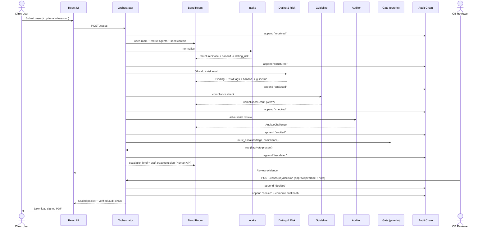
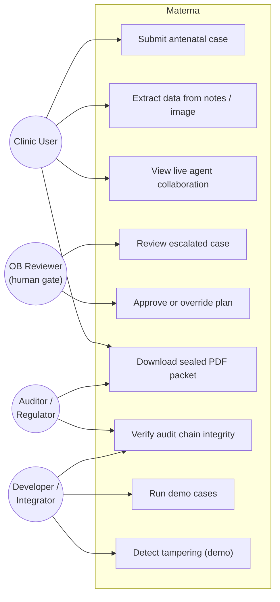
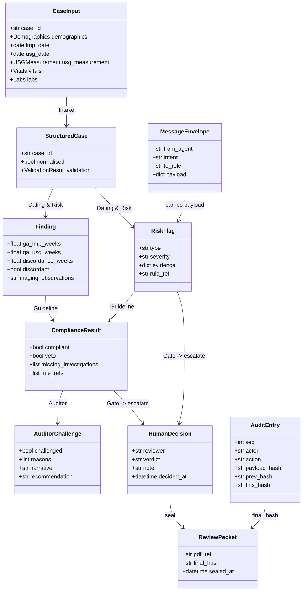
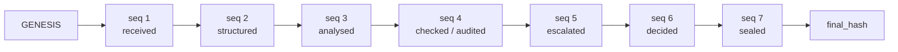
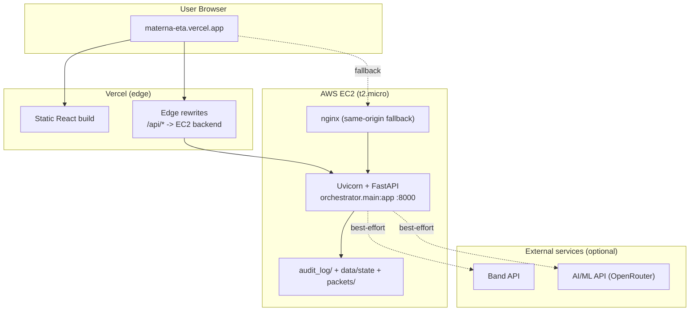

# Materna — Antenatal Review Board

**A Band-coordinated multi-agent obstetric safety system with a human obstetrician as the final decision gate.**

Materna runs every antenatal case through four specialist AI agents that collaborate over a shared [Band](https://lablab.ai) room. The moment a risk flag fires or a guideline veto triggers, the case is escalated to a human OB who holds final authority. Every state transition is written to a SHA-256 hash-chained audit log and emitted as a tamper-evident, signed PDF.

Built for the Band of Agents Hackathon (Track 3 — Regulated & High-Stakes Workflows).

| | |
| --- | --- |
| **Domain** | Antenatal (obstetric) care coordination and triage |
| **Coordination layer** | Band (Agent API + Human API + Rooms) |
| **Safety model** | Deterministic escalation gate + immutable audit chain + mandatory human gate |
| **Data** | Synthetic / anonymised only — no real PHI |
| **Status** | Hackathon build; live reference deployment on AWS + Vercel |

---

## Table of Contents

1. [The Problem](#1-the-problem)
2. [What Materna Does](#2-what-materna-does)
3. [Why It Is Valuable](#3-why-it-is-valuable)
4. [Design Principles](#4-design-principles)
5. [System Architecture](#5-system-architecture)
6. [The Four Agents](#6-the-four-agents)
7. [Case Lifecycle (State Machine)](#7-case-lifecycle-state-machine)
8. [End-to-End Sequence](#8-end-to-end-sequence)
9. [Use Cases](#9-use-cases)
10. [Data Model](#10-data-model)
11. [The Safety Architecture](#11-the-safety-architecture)
12. [Deployment Architecture](#12-deployment-architecture)
13. [How To Use This Product](#13-how-to-use-this-product)
14. [API Reference](#14-api-reference)
15. [Project Structure](#15-project-structure)
16. [Tech Stack](#16-tech-stack)
17. [Testing](#17-testing)
18. [Safety, Scope, and Limitations](#18-safety-scope-and-limitations)
19. [License](#19-license)

---

## 1. The Problem

Antenatal care is a coordination problem before it is a medical one. In high-volume, under-resourced clinics, a single clinician sees dozens of pregnant patients a day and must, for each one:

- Reconcile two independent estimates of gestational age (last menstrual period vs. ultrasound biometry) and notice when they disagree enough to change management.
- Scan vitals and labs for the early signatures of pre-eclampsia, gestational diabetes, and anaemia.
- Confirm the right follow-up investigations have actually been ordered.
- Document the reasoning in a way that survives an audit.

Each step is individually simple. The failure mode is that, at volume, steps get skipped, a dating discordance is missed, or a borderline blood pressure is normalised. These misses are exactly the ones that escalate into preventable maternal morbidity. Pakistan's maternal mortality ratio sits around **186 per 100,000 live births** — a figure driven heavily by late detection of conditions that are cheap to catch early.

The naive "AI fix" — let a model read the chart and decide — is unsafe and unauditable. A language model that hallucinates a "no concerns" verdict on a pre-eclamptic patient is worse than no tool at all.

## 2. What Materna Does

Materna reframes the task as **structured triage with a guaranteed human gate**, not autonomous diagnosis.

A case enters as free text, a form, or an ultrasound image. Four agents collaborate over a Band room:

1. **Intake** normalises the raw input into a validated, typed case.
2. **Dating & Risk** computes gestational age from both LMP and ultrasound, measures the discordance, and runs deterministic risk evaluators.
3. **Guideline** checks the case against a declarative rulebook and issues a veto when required investigations are missing.
4. **Auditor** adversarially re-reviews the Guideline's verdict and challenges it when the evidence and the conclusion disagree.

A **deterministic gate** — a pure 1-line function, never a model — then decides: any flag or any veto means the case escalates to a human obstetrician. Cases with no flags and no veto are auto-cleared. Either way, the case is sealed into a SHA-256 hash-chained record and a signed PDF.

The key property: **the decision to involve a human is structural, not probabilistic.** No prompt, no temperature setting, and no clever wording in the chart can talk the system out of escalating a flagged case.

## 3. Why It Is Valuable

| Stakeholder | Value delivered |
| --- | --- |
| **Clinician** | Removes the per-case reconciliation toil (GA math, lab thresholds, missing-test checks). Surfaces only the cases that genuinely need judgement, with the evidence pre-assembled. |
| **Patient** | Raises the floor on detection. A tired clinician can miss a 4-week dating discordance; a pure function cannot. |
| **Clinic / system owner** | Produces a tamper-evident, signed record for every case — defensible under audit, and a foundation for quality metrics. |
| **Regulator** | The escalation decision is inspectable code, the audit chain is verifiable, and the human always holds final authority. There is no autonomous diagnostic claim to certify. |

What makes this credible rather than aspirational:

- **The safety guarantee is testable.** The escalation gate is a pure function with adversarial tests proving it cannot be bypassed.
- **The math is code, not vibes.** Gestational age, risk thresholds, and guideline checks are deterministic functions reading from a declarative rulebook — same input, same output, every time.
- **It degrades safely.** If Band is offline, if the LLM has no credits, the case is still reviewed and still escalated correctly. Band and the LLM add visibility and ergonomics, never safety.

## 4. Design Principles

These eight rules are enforced throughout the codebase, several of them by tests that fail CI on violation.

1. **Band is the coordination layer.** Agents communicate through Band rooms via typed message envelopes. No agent imports or calls another agent's functions directly.
2. **The escalation gate is deterministic.** `must_escalate()` is a pure function. An LLM never decides whether to escalate.
3. **Synthetic data only.** No real PHI ever enters the system.
4. **Decision-support framing.** The human OB holds final authority on every flagged case; imaging output is labelled decision-support, never diagnosis.
5. **Math and rules are code.** GA, risk, and guideline logic are deterministic functions; thresholds live in `data/rules/antenatal_rules.yaml`.
6. **Everything is audited.** Every state transition appends a SHA-256 hash-chained entry.
7. **Tests gate progress.** ~132 tests across 10 files, including an adversarial hardening suite.
8. **Secrets live in `.env` only.** Never hardcoded, never committed; enforced by a secret-hygiene test.

## 5. System Architecture

High-level component view. The UI talks only to the FastAPI orchestrator; the orchestrator drives a Band room and the four agents; the safety primitives (gate, risk rules, audit chain) are pure code paths the orchestrator calls directly.



### Component responsibilities

| Component | Path | Responsibility |
| --- | --- | --- |
| Orchestrator / state machine | `orchestrator/lifecycle.py` | Drives a case through every state; owns Band session and audit writes |
| Escalation gate | `orchestrator/gate.py` | Pure function deciding escalate vs. auto-clear |
| API surface | `orchestrator/main.py` | FastAPI routes (cases, decisions, packet, audit, demo, extract) |
| Recruitment | `orchestrator/recruit.py` | Opens the Band room and recruits agents |
| Agents | `agents/*/agent.py` | Four specialists, each with a Band-mode and a local-mode entrypoint |
| Band wrapper | `band_wrapper/client.py` | `open_room`, `recruit`, `post`; `band_available()` graceful degradation |
| Deterministic tools | `tools/ga_calc.py`, `risk/rules.py`, `tools/guideline_kb.py` | GA math, risk evaluators, rule loading/checking |
| LLM tools | `tools/imaging.py`, `tools/treatment.py` | Vision decision-support, treatment-plan drafting |
| Audit chain | `audit/chain.py` | Append-only SHA-256 hash chain + verification |
| Packet | `packet/generator.py` | Sealed clinical PDF |
| Schemas | `schemas.py` | Pydantic v2 models — single source of truth |

## 6. The Four Agents

Each agent is isolated: it has a Band-mode entrypoint (`run_*`) that does all I/O through the room, and a local-mode entrypoint (`run_*_local`) that the orchestrator calls directly when Band is unavailable. The safety properties are identical in both modes.

| Agent | Input | Output | LLM use | Deterministic core |
| --- | --- | --- | --- | --- |
| **Intake** | Raw case (text / form / JSON) | `StructuredCase` | Extraction (with local regex fallback) | Schema validation, field-level errors |
| **Dating & Risk** | `StructuredCase` | `Finding` + `RiskFlag[]` | Imaging observation phrasing only | GA from LMP and ultrasound, discordance, risk evaluators |
| **Guideline** | Structured case + findings + flags | `ComplianceResult` (+ veto) | None | Rulebook lookup, missing-investigation detection |
| **Auditor** | Flags + `ComplianceResult` | `AuditorChallenge` | Challenge *narrative* only | `_should_challenge()` decides whether to challenge |

The **Auditor** is the design's distinctive move. Most multi-agent demos chain agents in series and trust the last one. Materna adds an adversary whose *decision to challenge is deterministic code* (`agents/auditor/agent.py:_should_challenge`) — the LLM only phrases the challenge. It fires when, for example, a high-severity flag coexists with a `compliant=True` verdict, or when a veto-eligible rule fired but the Guideline did not veto. The challenge cannot be hallucinated away because the trigger is structural.

## 7. Case Lifecycle (State Machine)

The lifecycle in `orchestrator/lifecycle.py` is an explicit state machine. Every transition appends an audit entry; any unhandled error routes the case to `QUARANTINED` rather than failing silently.



The gate sits on exactly one transition (`AUDITED → AUTO_CLEARED | ESCALATED`) and is evaluated exactly once per case. There is no other path to `SEALED` that skips it.

## 8. End-to-End Sequence

A flagged case (e.g. C-0001) traverses the full pipeline. Note that every inter-agent handoff is a typed envelope posted to the Band room.



For a clean case (C-0002) the gate returns `false`, the orchestrator records a `SYSTEM (auto-cleared)` decision, and the case is sealed without a human round-trip.

## 9. Use Cases



| ID | Use case | Primary actor | Outcome |
| --- | --- | --- | --- |
| UC1 | Submit antenatal case | Clinic user | Case enters the lifecycle; pipeline runs |
| UC2 | Extract from notes / ultrasound | Clinic user | Free text or image normalised into form fields |
| UC3 | Watch agents collaborate | Clinic user | Live Band room view of typed handoffs |
| UC4 | Review escalated case | OB reviewer | Evidence, flags, compliance, and draft plan presented |
| UC5 | Approve / override | OB reviewer | Human decision recorded immutably |
| UC6 | Download sealed packet | Clinic user / regulator | Signed, tamper-evident PDF |
| UC7 | Verify audit chain | Regulator / developer | Pass/fail + exact break position |
| UC8 | Run demo cases | Developer | All four scenarios executed end-to-end |
| UC9 | Tamper detection demo | Developer | Chain break detected at exact sequence |

## 10. Data Model

All structures are Pydantic v2 models defined once in `schemas.py`. Every module imports from here; there are no duplicate definitions.



## 11. The Safety Architecture

Three primitives carry the entire safety promise. None of them is an LLM.

### 11.1 Deterministic escalation gate

`orchestrator/gate.py` — the crown jewel, in full:

```python
def must_escalate(flags: list[RiskFlag], compliance: ComplianceResult) -> bool:
    return bool(flags) or compliance.veto
```

A pure function: no network, no database, no model, no side effects. Same inputs always yield the same output. It is called exactly once per case in the lifecycle, and there is no alternate route to a sealed-and-cleared state. The hardening suite includes adversarial tests that attempt to bypass it — including prompt-injection payloads embedded in case text — and all fail.

### 11.2 SHA-256 hash-chained audit log

`audit/chain.py` implements an append-only JSONL chain, one file per case under `audit_log/`:

- **Genesis:** the first entry's `prev_hash` is `sha256:GENESIS`.
- **Link formula:** `this_hash = sha256(f"{seq}|{case_id}|{actor}|{action}|{payload_hash}|{prev_hash}")`.
- **Canonical payload hashing:** `json.dumps(payload, sort_keys=True, separators=(",", ":"))` — key ordering can never cause a spurious mismatch.
- **Verification:** `verify_chain()` recomputes every link from genesis to tip and returns `(ok, first_broken_seq)`, pinpointing exactly where any tampering occurred.



The `POST /demo/tamper/{id}` endpoint deliberately corrupts a chain so a reviewer can watch verification fail at the exact sequence number — a one-click proof that tampering is detectable.

### 11.3 Pure-function risk and dating logic

Risk evaluators (`risk/rules.py`) and GA math (`tools/ga_calc.py`) are deterministic, with thresholds sourced from `data/rules/antenatal_rules.yaml`:

| Rule | Condition | Severity | Required investigations | Veto if missing |
| --- | --- | --- | --- | --- |
| PE-001 | BP ≥ 140/90 **and** urine protein in {1+, 2+, 3+} | high | repeat BP (4h), 24h urine protein | yes |
| GDM-002 | fasting glucose ≥ 92 mg/dL | moderate | OGTT | yes |
| ANE-003 | Hb < 11.0 g/dL | moderate | iron studies | no |
| DATE-004 | LMP vs. ultrasound discordance ≥ 2.0 weeks | — | prefer ultrasound dating | — |

GA is computed two ways and compared: from LMP `(ref - lmp).days / 7`, and from ultrasound biometry via Hadlock-style approximations for BPD, CRL, FL, HC, and AC. A discordance at or above the 2.0-week threshold is the classic, easily-missed signal Materna is built to never miss.

## 12. Deployment Architecture

The reference deployment runs the backend on AWS EC2 and the frontend on Vercel, with Vercel edge rewrites proxying API calls to the backend to solve the HTTPS-to-HTTP mixed-content problem. An nginx same-origin fallback on EC2 provides redundancy. Everything also runs locally via Docker Compose.



| Component | Platform | Notes |
| --- | --- | --- |
| Backend | AWS EC2 (Uvicorn + FastAPI) | Single instance; state persisted to disk |
| Frontend | Vercel (static React) | Edge rewrites proxy `/api` to backend |
| Frontend fallback | EC2 nginx | Same-origin serving for redundancy |
| Local | Docker Compose | `orchestrator` + `ui` services |

## 13. How To Use This Product

### 13.1 For clinicians (the UI workflow)

1. Open the Dashboard. Paste clinical notes (English or Urdu) into **Smart Paste**, fill the patient form directly, or upload an ultrasound image. Smart Paste extracts values and auto-fills the form.
2. Submit to the review board. The processing view shows the four agents activating in sequence, with a live Band room transcript of their typed handoffs.
3. Read the results, which appear as progressive cards: gestational age (LMP vs. ultrasound + discordance), risk flags with evidence, guideline verdict, and the auditor's review.
4. If the case is escalated, the human review panel presents a draft work-up plan. The named OB reviewer approves it or overrides with a note.
5. On seal, download the signed PDF packet and, if desired, verify the audit chain in one click.

### 13.2 Quick start (local, no keys required)

The system runs fully locally with no Band or LLM keys — agents fall back to deterministic local mode.

**Prerequisites:** Python 3.11+, Node.js 18+.

```bash
# 1. Clone and enter
git clone <repo-url> && cd antenatal-review-board

# 2. Configure (an empty .env is fine for local mode)
cp .env.example .env

# 3. Python environment
python -m venv .venv && source .venv/bin/activate
pip install -r requirements.txt

# 4. Run the API
python -m uvicorn orchestrator.main:app --host 0.0.0.0 --port 8000

# 5. In another terminal: run all four demo cases
curl -X POST http://localhost:8000/demo/run-all
```

### 13.3 Run the UI

```bash
cd ui
npm install
npm run dev
# open http://localhost:5173
```

### 13.4 Enable Band and LLM features (optional)

Add to `.env`:

```bash
BAND_API_KEY=...            # promo code for the hackathon: BANDHACK26
BAND_INTAKE_ID=...          # participant ids for each recruited agent
BAND_DATING_RISK_ID=...
BAND_GUIDELINE_ID=...
BAND_AUDITOR_ID=...
AIML_API_KEY=...            # AI/ML API via OpenRouter, for extraction/narratives
```

With `BAND_API_KEY` set and the SDK installed, the orchestrator opens a real Band room per case and recruits the agents over the Agent API. Without it, `band_available()` returns false and the pipeline runs locally — with identical safety behaviour. Set `BAND_DISABLE=1` to force local mode even when a key is present.

### 13.5 Submit your own case (API)

```bash
curl -X POST http://localhost:8000/cases \
  -F 'case={"case_id":"C-DEMO","demographics":{"age":29,"parity":"G3P2"},
            "lmp_date":"2025-12-01","usg_date":"2026-06-10",
            "usg_measurement":{"type":"BPD","value_mm":58},
            "vitals":{"bp_systolic":150,"bp_diastolic":98},
            "labs":{"urine_protein":"2+","fasting_glucose_mg_dl":104,"hb_g_dl":10.1}}'

curl http://localhost:8000/cases/C-DEMO          # state, findings, flags, compliance
curl http://localhost:8000/cases/C-DEMO/audit    # audit chain + verification
```

### 13.6 Demo cases

| Case | Scenario | Expected outcome |
| --- | --- | --- |
| C-0001 | 29y G3P2, BP 150/98, protein 2+, glucose 104, Hb 10.1; ~4.3 wk dating discordance | ESCALATED (PE-001 high, GDM-002, ANE-003) then sealed on decision |
| C-0002 | 25y G1P0, normal vitals and labs | AUTO_CLEARED then sealed |
| C-0003 | 34y G5P4, BP 142/92, protein 1+, glucose 95, Hb 10.5 | ESCALATED (triple flag) |
| C-0004 | 22y G2P1, BP 165/105, protein 3+, Hb 9.2 | ESCALATED, auditor challenge |

## 14. API Reference

Base URL: `http://localhost:8000`

| Method | Path | Purpose |
| --- | --- | --- |
| GET | `/health` | Backend connectivity probe |
| POST | `/extract` | Extract structured fields from clinical text |
| POST | `/extract-image` | Vision extraction from an ultrasound image |
| POST | `/cases` | Submit a case (multipart form; `case` = JSON string, optional image) |
| GET | `/cases/{id}` | Case state: findings, flags, compliance, decision |
| GET | `/cases/{id}/room` | Band room conversation (typed envelopes) |
| POST | `/cases/{id}/decision` | Record human verdict (`approve`/`override` + note) |
| GET | `/cases/{id}/packet` | Download the sealed PDF packet |
| GET | `/cases/{id}/audit` | Audit chain + SHA-256 verification status |
| POST | `/demo/tamper/{id}` | Deliberately corrupt a chain (tamper-detection demo) |
| POST | `/demo/run-all` | Run all four demo cases and return results |

## 15. Project Structure

```
antenatal-review-board/
├── orchestrator/             FastAPI app + lifecycle state machine + gate
│   ├── main.py               REST routes + health + extract + demo runners
│   ├── lifecycle.py          Full state machine (Band mode + local mode)
│   ├── gate.py               must_escalate() — pure function, never an LLM
│   └── recruit.py            Band room + agent recruitment
├── agents/                   Four specialists (communicate via Band)
│   ├── intake/agent.py       Normalise + validate -> StructuredCase
│   ├── dating_risk/agent.py  GA calc + discordance + imaging + risk flags
│   ├── guideline/agent.py    Rulebook check -> ComplianceResult + veto
│   └── auditor/agent.py      Adversarial reviewer — challenges Guideline
├── band_wrapper/client.py    Band coordination (open_room, recruit, post)
├── tools/
│   ├── ga_calc.py            GA math (LMP + ultrasound) — pure functions
│   ├── guideline_kb.py       Rule loader + deterministic checker + veto logic
│   ├── imaging.py            Vision decision-support (never diagnostic)
│   └── treatment.py          Treatment-plan drafting
├── risk/rules.py             Deterministic risk evaluators (PE, GDM, anaemia)
├── audit/chain.py            SHA-256 hash-chained JSONL audit log + verify
├── packet/generator.py       ReportLab sealed PDF packet
├── schemas.py                Pydantic v2 models — single source of truth
├── data/
│   ├── cases/                Four synthetic demo cases
│   ├── rules/antenatal_rules.yaml   Declarative guideline ruleset
│   ├── state/                Persisted case states
│   └── usg/                  Ultrasound images
├── ui/                       React 18 + Vite + Tailwind v3 frontend
├── tests/                    ~132 tests across 10 files
├── docker-compose.yml        Orchestrator + UI services
└── Dockerfile                Python 3.11-slim
```

## 16. Tech Stack

| Layer | Choice | Rationale |
| --- | --- | --- |
| Coordination | Band (SDK / Agent API / Human API) | The judged collaboration layer; rooms + recruitment + human gate |
| Model inference | AI/ML API via OpenRouter (gpt-4o-mini) | Unified model access for extraction and narratives only |
| Orchestrator / agents | Python 3.11 + FastAPI | Async-friendly; clean REST surface |
| Schemas | Pydantic v2 | Single source of truth; validated at every boundary |
| Imaging | Gemini Vision via AI/ML API | Decision-support; no model training required |
| Packet | ReportLab | Professional clinical PDF output |
| Audit | hashlib (SHA-256) + JSONL | Tamper-evidence without a blockchain |
| UI | React 18 + Vite + Tailwind v3 + Framer Motion + lucide-react | Glass-morphism design system; progressive disclosure |
| Packaging | Docker Compose | Single-host deploy |

## 17. Testing

```bash
pytest tests/ -v        # Python backend
cd ui && npm test       # Frontend (Vitest)
```

Roughly 132 tests across 10 files (9 Python suites plus the frontend client). The standout is the adversarial hardening suite (`tests/test_hardening.py`), which proves the safety claims rather than merely asserting them:

- **Gate bypass attempts** — `must_escalate()` cannot be tricked into clearing a flagged case.
- **Prompt injection** — text injected into case data cannot bypass the gate.
- **Determinism** — risk rules produce identical output across repeated calls on identical input.
- **Audit integrity** — tampering is detected at the exact sequence number.
- **Secret hygiene** — no API keys in source; `.env` is gitignored; `.env.example` carries no real keys.

The remaining suites cover the lifecycle, risk rules, GA math, guideline checks, agent coordination, API contracts, and the frontend client.

## 18. Safety, Scope, and Limitations

- **Synthetic / anonymised data only.** No real PHI ever enters the system.
- **Decision-support, not diagnosis.** Imaging output is explicitly labelled decision-support; the human OB holds final authority on every flagged case.
- **The gate is deterministic.** An LLM never decides whether to escalate.
- **Tamper-evident, not tamper-proof.** The hash chain makes any post-hoc edit detectable; it does not prevent edits.
- **Hackathon scope.** Single-instance, in-memory store backed by disk; the rulebook covers a focused set of antenatal conditions; the local intake normaliser is regex-based and handles common patterns, with the LLM path for harder inputs.
- **No autonomous diagnostic or treatment claims.** Materna coordinates and triages; clinicians decide.

## 19. License

MIT © 2026 Abdul Moiz Ahmed. See [LICENSE](LICENSE).
